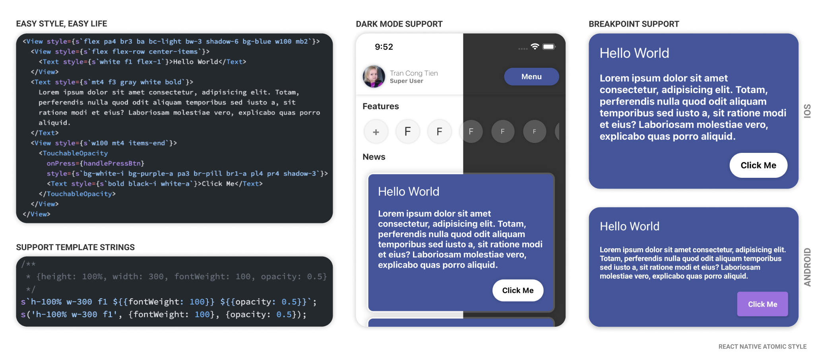

# React Native Atomic Style
> Make your react native style more easier



## Install
```bash
# Install using yarn
yarn add @tctien342/react-native-atomic-style
# Or prefer npm way
npm install @tctien342/react-native-atomic-style
```

## Usage
```ts
  // Use with `useStyleBuilder`
  const {s, style, isDarkMode, setDarkMode} = useStyleBuilder();
```
What included:
### `s(query: string | TemplateStringArray, ...args: PropStyle[])` 
> Use for tranform style string into react native style

Can be use as two way:
```ts
 s('h-100% w-100%', {backgroundColor: "#123321"}) // Function style
 s`h-100% w-100% ${{backgroundColor: "#123321"}}` // Template string style
 // Output => {height: 100%, width: 100%, backgroundColor: "#123321"}
```
### `isDarkMode: boolean` and `setDarkMode(state: boolean)`
> Use for set app dark mode and get current darkmode value

### `style: IAppStyles`
> Current style of app, for getting style value

## Support breaks point
> For switching style between OS and screens

```ts
const defaultBreakpoint = {
    i: Platform.OS === 'ios',
    a: Platform.OS === 'android',
    web: Platform.OS === 'web',
    win: Platform.OS === 'windows',
    mac: Platform.OS === 'macos',
    l: (dark) => !dark,
    d: (dark) => dark,
    pad: SCREEN_TYPE === 'pad',
    lg: SCREEN_TYPE === 'lg',
    sm: SCREEN_TYPE === 'sm',
};
// Example
s`bg-white-i bg-purple-a pa3 br-pill br1-a pl4 pr4 shadow-3`
// => Android will have purple background and ios will have white background
```


## Example
```tsx
import {useStyleBuilder} from '@tctien342/react-native-atomic-style';
/**COMPONENT**/
const {s} = useStyleBuilder();

return <View style={s`flex pa4 br3 ba bc-light bw-3 shadow-6 bg-blue w100 mb2`}>
  <View style={s`flex flex-row center-items`}>
    <Text style={s`white f1 flex-1`}>Hello World</Text>
  </View>
  <Text style={s`mt4 f3 gray white bold`}>
    Lorem ipsum dolor sit amet consectetur, adipisicing elit. Totam,
    perferendis nulla quod odit aliquam temporibus sed iusto a, sit
    ratione modi et eius? Laboriosam molestiae vero, explicabo quas porro
    aliquid.
  </Text>
  <View style={s`w100 mt4 items-end`}>
    <TouchableOpacity
      style={s`bg-white-i bg-purple-a pa3 br-pill br1-a pl4 pr4 shadow-3`}>
      <Text style={s`bold black-i white-a`}>Click Me</Text>
    </TouchableOpacity>
  </View>
</View>

```

## Make your own builder with `makeCustomBuilder`
> You can make an custom builder for your app style
```ts
const {useStyleBuilder} = makeCustomBuilder({
  light: {
    COLORS: {BLUE: '#445599', PINK: '#ff4499'},
    SOLID: {
      l1: 4,
      l2: 8,
      l3: 12,
      l4: 18,
      l5: 32,
      l6: 48,
      l7: 64,
    },
  },
  dark: {
    COLORS: {BLUE: '#445599', PINK: '#ff4499'},
    SOLID: {
      l1: 4,
      l2: 8,
      l3: 12,
      l4: 18,
      l5: 32,
      l6: 48,
      l7: 64,
    },
  },
  // w-100%-lol => only in IOS and Darkmode is turned on
  breakpoints: {lol: (isDark: boolean) => isDark && Platform.OS === 'ios'},
  builder: style => ({
    wow: {
      fontSize: 24 * style.SOLID.l1,
      fontWeight: "600",
      color: style.COLORS.PINK,
    },
    wow2: {
      fontSize: 24 * style.SOLID.l2,
      fontWeight: "600",
      color: style.COLORS.PINK,
    },
    // wow3-value1-value2...
    wow3: (value1: number, value2: string) =>({
      fontSize: 24 * value1,
      fontWeight: "600",
      color: value2,
    })
  }),
});
// IMPORT YOUR useStyleBuilder into COMPONENT
const {s} = useStyleBuilder();
// Try it
s`wow-lol wow3-3-#123321`
```

### Default config

> Default value if use `useStyleBuilder` directly from library

```ts
EARLY_DEVICE_RATIO_POINT: 1.8,
THEME_MODE: 'light',
THEME_AUTO: true,
SCALE_BASE: 0.95,
SOLID_SIZE: {
  l1: 4,
  l2: 8,
  l3: 12,
  l4: 18,
  l5: 32,
  l6: 48,
  l7: 64,
},
FONT_SIZE: {
  f1: 26,
  f2: 22,
  f3: 18,
  f4: 14,
  f5: 12,
  f6: 10,
  f7: 8,
},
COLORS_LIGHT: {
  PRIME: '#389bff',
  PURPLE: '#9b71de',
  BLUE: 'blue',
  RED: '#de2f2f',
  ORANGE: 'orange',
  GREEN: 'green',
  WHITE: 'white',
  FONT_LIGHT: '#717171',
  FONT_HARD: '#2b2b2b',
  BACKGROUND_LIGHT: '#f6f6f6',
  BACKGROUND_MED: 'white',
  BACKGROUND_HARD: 'white',
  BLACK: '#000',
  GRAY: '#b6c0cc',
},
COLORS_DARK: {
  PRIME: '#389bff',
  PURPLE: '#9b71de',
  BLUE: 'blue',
  RED: '#ff0266',
  ORANGE: 'orange',
  GREEN: 'green',
  WHITE: 'white',
  FONT_LIGHT: '#5D5D5D',
  FONT_HARD: '#D7D7D7',
  BACKGROUND_LIGHT: '#585858',
  BACKGROUND_MED: '#464646',
  BACKGROUND_HARD: '#333333',
  BLACK: '#000',
  GRAY: '#b6c0cc',
},
LIGHT_FONT_WEIGHT: { thin: '200', bold: 'bold', default: 'normal' },
DARK_FONT_WEIGHT: { thin: '300', bold: 'bold', default: 'normal' },
```

### Support command
> Read more at style folder

| Command                  | About                                                                          | Note                                                                            |
| :----------------------- | :----------------------------------------------------------------------------- | :------------------------------------------------------------------------------ |
| <b>View Size             |                                                                                |                                                                                 |
| vw-{size}                | Width base on screen's width                                                   | value as percent                                                                |
| vw{percent}              | Width base on screen's width                                                   | value as percent, 10 each step                                                  |
| vh-{size}                | Height base on screen's height                                                 | value as percent                                                                |
| vh{percent}              | Height base on screen's height                                                 | value as percent, 10 each step                                                  |
| vh{solidLevel}           | Height = Width = min screen's dimentions (Square view)                         | Solid level, from 1 - 7                                                         |
| wh-{size}                | Height = Width = min screen's dimentions (Square view)                         | value as percent                                                                |
| wh{solidLevel}           | Height = Width = min screen's dimentions (Square view)                         | Solid level, from 1 - 7                                                         |
| h-{size}                 | height of view, base on parent size for percent or pixel                       | can be h-100% for 100% or h-100 for 100px                                       |
| h{solidLevel}            | height of view, base on parent size for percent or pixel                       | Solid level, from 1 - 7                                                         |
| w-{size}                 | width of view, base on parent size for percent or pixel                        | can be w-100% for 100% or w-100 for 100px                                       |
| w{solidLevel}            | width of view, base on parent size for percent or pixel                        | Solid level, from 1 - 7                                                         |
| mh-{size}                | maxHeight of view, base on parent size for percent or pixel                    | can be mh-100% for 100% or mh-100 for 100px                                     |
| mh{solidLevel}           | maxHeight of view, base on parent size for percent or pixel                    | Solid level, from 1 - 7                                                         |
| mw-{size}                | maxWidth of view, base on parent size for percent or pixel                     | can be mw-100% for 100% or mw-100 for 100px                                     |
| mw{solidLevel}           | maxWidth of view, base on parent size for percent or pixel                     | Solid level, from 1 - 7                                                         |
| mvh-{size}               | maxHeight of view, base on phone's height                                      | value as percent                                                                |
| mvw-{size}               | maxWidth of view, base on phone's width                                        | value as percent                                                                |
| flex-{size}              | define flex size of view                                                       | value as number, default is 1                                                   |
| <b>Text styles           |                                                                                |
| tc                       | textAlign: center                                                              |                                                                                 |
| tl                       | textAlign: left                                                                |                                                                                 |
| tr                       | textAlign: right                                                               |                                                                                 |
| f{fontLevel}             | fontSize: \${fontLevel}                                                        | With font level from 1-7                                                        |
| fw-{weightLevel}         | fontWeight: \${weightLevel}                                                        | This is font weight level                                                       |
| bold                     | fontWeight: \${boldSize}                                                       |                                                                                 |
| thin                     | fontWeight: \${thinSize}                                                       |                                                                                 |
| <b>Object position       |                                                                                |
| absolute                 | position: absolute                                                             |                                                                                 |
| relative                 | position: relative                                                             |                                                                                 |
| top-{pos}                | set top position                                                               | can be top-10 for 10px or top-10% for 10% from top                              |
| bottom-{pos}             | set bottom position                                                            | can be bottom-10 for 10px or bottom-10% for 10% from bottom                     |
| left-{pos}               | set left position                                                              | can be left-10 for 10px or left-10% for 10% from left                           |
| right-{pos}              | set right position                                                             | can be right-10 for 10px or right-10% for 10% from right                        |
| z-{index}                | set zIndex of view                                                             | value as number > 0 only                                                        |
| z100                | set 100 zIndex of view                                                            | |
| z999                | set 999 zIndex of view                                                             |                                                       |
| z9999                | set 9999 zIndex of view                                                             ||
| pa-{size}                | padding view by size                                                           | size can be `10%` for percent or `10` for pixel                                 |
| pt-{size}                | paddingTop view by size                                                        | size can be `10%` for percent or `10` for pixel                                 |
| pb-{size}                | paddingBottom view by size                                                     | size can be `10%` for percent or `10` for pixel                                 |
| pl-{size}                | paddingLeft view by size                                                       | size can be `10%` for percent or `10` for pixel                                 |
| pr-{size}                | paddingRight view by size                                                      | size can be `10%` for percent or `10` for pixel                                 |
| ma-{size}                | margin view by size                                                            | size can be `10%` for percent or `10` for pixel                                 |
| mt-{size}                | marginTop view by size                                                         | size can be `10%` for percent or `10` for pixel                                 |
| mb-{size}                | marginBottom view by size                                                      | size can be `10%` for percent or `10` for pixel                                 |
| ml-{size}                | marginLeft view by size                                                        | size can be `10%` for percent or `10` for pixel                                 |
| mr-{size}                | marginRight view by size                                                       | size can be `10%` for percent or `10` for pixel                                 |
| > All object position have solid size by {prefix}{solidLevel} with solid level from 1 - 7
| <b>Border properties     |                                                                                |
| ba                       | borderStyle solid                                                              |                                                                                 |
| bat-{width}                   | borderStyle solid, borderTopWidth                                          |                                                                            |
| bab-{width}                   | borderStyle solid, borderBottomWidth                                              |                                                                            |
| bar-{width}                   | borderStyle solid, borderRightWidth                                              |                                                                            |
| bal-{width}                   | borderStyle solid, borderLeftWidth                                              |                                                                            |
| b--dot                     | borderStyle dotted                                                             |                                                                                 |
| b--dash                    | borderStyle dashed                                                             |                                                                                 |
| bw-{size}                | borderWidth size                                                               | size can be `10%` for percent or `10` for pixel                                 |
| br{solidSize}            | borderRadius with solid size                                                   | solid size from 1 - 7 level                                 | 
| br-pill                 | borderRadius \${pill radius}                                                   |                                                                                 |
| br--bottom               | borderRadius only bottom                                                       |                                                                                 |
| br--top                  | borderRadius only top                                                          |                                                                                 |
| br--left                 | borderRadius only left                                                         |                                                                                 |
| br--right                | borderRadius only right                                                        |                                                                                 |
| <b>Utils properties      |                                                                                |
| center-items              | center all items in view                                                       |                                                                                 |
| justify-{center,start,end}            | justifyContent                                                          |                                                                                 |
| items-{center,start,end}              | alignItems                                                              |                                                                                 |
| flex-row                      | flexDirection: row                                                             |                                                                                 |
| flex-column                   | flexDirection: column                                                          |                                                                                 |
| flex-{wrap,nowrap}       | flexWrap                                              |                                                                                 |
| overflow-{visible,hidden,scroll} | overflow                                                      |                                                                                 |
| shadow-${depth}-${color} | Drop shadow to view                                                            | depth as number default 3, color default #000, depth and color only work on ios |
| <b>Color properties      |                                                                                |
| o-{alpha}                | opacity: alpha size                                                            | alpha size from 0-100 as percent                                                |
| white                    | color: \${white}                                                               |
| prime                    | color: \${prime}                                                               |
| purble                   | color: \${purble}                                                              |
| blue                     | color: \${blue}                                                                |
| orange                   | color: \${orange}                                                              |
| red                      | color: \${red}                                                                 |
| green                    | color: \${green}                                                               |
| black                    | color: \${black}                                                               |
| light                    | color: \${fontLight}                                                           |
| hard                     | color: \${fontHard}                                                            |
| {color}-{alphaPercent}   | color: \${color} with alpha percent                                         | `alphaPercent` Should in range (0-100)|
| bg-{color}-{alphaPercent}               | backgroundColor: color, support all above color, default as \${backgroundHard} | `light` and `hard` color with changed to `flight` and `fhard`                   |
| bg-med                   | color: \${backgroundMedium}                                                    |
| bg-light                 | color: \${backgroundLight}                                                     |
